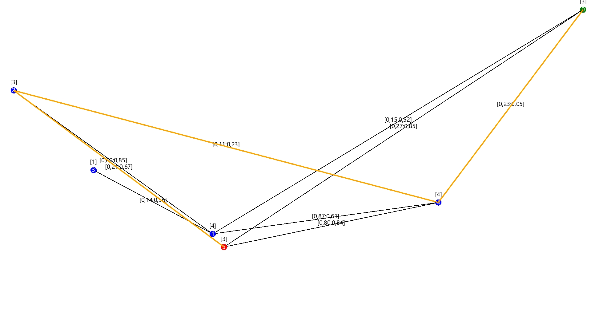

# SDK:
[Установить .NET 8+ SDK](https://dotnet.microsoft.com/en-us/download/dotnet/8.0)

# Зависимости:
- SkiaSharp (рисует картинки)

# Для запуска: 
1. Установите SDK.
2. 
   ```cmd
   cd ../RoutingAlgorithms	
   dotnet restore
   dotnet run


```csharp
Program.cs
var nodes = GraphGenerator.RandomTree(numNodes:6, connectionProbability: 0.3f);
var source = nodes.First();
var dest = nodes.Last();
var result = SAMCRA.FindRoute(  source: source, 
                                destination: dest, 
                                routeMaxCost:2f, 
                                routeMaxTime:2f
                             );
```

На выходе получается изображение графа:

На серединах ребер метрика [ЦЕНА ПЕРЕХОДА:ВРЕМЯ ПЕРЕХОДА]
ЗЕЛЕНЫЙ - начало
КРАСНЫЙ - конец
Над узлами [N] свзяность узла
ЖЕЛТЫЙ - путь